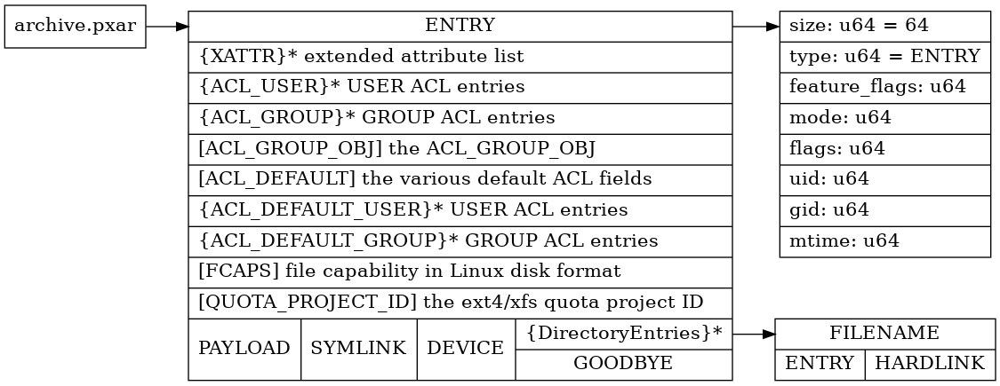

# PXAR Format

## Background
We are currently building a go library for the PXAR Archive format, and have been gathering information about the format by dissecting the archives and gathering information from the proxmox repository and other tools (mainly 
 [@tizbac s proxmoxbackupclient_go](https://github.com/tizbac/proxmoxbackupclient_go))

## Official Overview (V1 format)


## Base Entry Types
| Name | Identifier | Description |
| ---- | ---------- | ----------- |
| PXAR_ENTRY | ```0xd5956474e588acef``` | Stores metadata information about the entry |
| PXAR_ENTRY_V1 | ```0x11da850a1c1cceff``` | Older version of PXAR_ENTRY |
| PXAR_FILENAME | ```0x16701121063917b3``` | Stores the filename of the following item |
| PXAR_PAYLOAD | ```0x28147a1b0b7c1a25``` | The entry payload, e.g. symlink target or file contents |
| PXAR_SYMLINK | ```0x27f971e7dbf5dc5f``` | Stores symlink target and metadata |
| PXAR_HARDLINK | ```0x51269c8422bd7275``` | Stores hardlink  |
| PXAR_GOODBYE | ```0x2fec4fa642d5731d``` | PXAR_GOODBYE contains hashes of all files in a folder |
| PXAR_GOODBYE_TAIL_MARKER | ```0xef5eed5b753e1555``` | End of goodbye record |
| PXAR_DEVICE | ```0x9fc9e906586d5ce9``` | Stores information about device records |
| PXAR_XATTR | ```0x0dab0229b57dcd03``` | Stores extended attributes for a file/folder |
| PXAR_ACL_USER | ```0x2ce8540a457d55b8``` | User ACL Entries |
| PXAR_ACL_GROUP | ```0x136e3eceb04c03ab``` | Group ACL Entries |
| PXAR_ACL_GROUP_OBJ | ```0x10868031e9582876``` | ACL_GROUP_OBJ |
| PXAR_ACL_DEFAULT | ```0xbbbb13415a6896f5``` | various default ACL fields |
| PXAR_ACL_DEFAULT_USER | ```0xc89357b40532cd1f``` | User ACL Entries |
| PXAR_ACL_DEFAULT_GROUP | ```0xf90a8a5816038ffe``` | Group ACL Entries |
| PXAR_FCAPS | ```0x2da9dd9db5f7fb67``` | File capability information, Linux disk format |
| PXAR_QUOTA_PROJID | ```0xe07540e82f7d1cbb``` | Quota information |

### Order
#### File
- PXAR_ENTRY
- PXAR_FILENAME
- PXAR_XATTR
- PXAR_ACL
- PXAR_FCAPS
- PXAR_QUOTA_PROJID
- PXAR_PAYLOAD

#### Folder
- PXAR_ENTRY
- PXAR_FILENAME
  - Files, links, nested folders
- PXAR_GOODBYE


### Common
- All records include a descriptor header (table below)
- All numbers are little-endian

| Field | Type | Description | Example |
| ---- | ----- | ----------- | ------- |
| Type | uint64 | The identifier from the table above | ```0xd5956474e588acef``` |
| Length | uint64 | The length of the following record + 16 (length of self) | ```56``` |

### PXAR_ENTRY
**Length**: Fixed, linux stat struct length as uint64

| Field | Type | Description | Example |
| ---- | ----- | ----------- | ------- |
| Mode | uint64 | File or folder mode | ``` 0o777 ``` |
| Flags | uint64 | Flags on the object | ``` 0 ``` |
| Uid | uint32 | User ID | ``` 1000 ``` |
| Gid | uint32 | Group ID |``` 1000 ``` |
| MtimeSecs | uint64 | ModifiedTime Seconds | ``` 0 ``` |
| MtimeNanos | uint32 | ModifiedTime Nanoseconds | ``` 0 ``` |
| MtimePadding | uint32 | ModifiedTime Padding | ``` 0 ``` |

### PXAR_FILENAME
**Length**: Variable, max length 4096 + 1 (null-termination)

| Field | Type | Description | Example |
| ---- | ----- | ----------- | ------- |
| Filename | []byte | The decoded filename | ``` test.txt ``` |
| Null Termination | byte | Terminates the filename with a null byte | ``` 0x00 ``` |


### PXAR_PAYLOAD
**Length**: Variable, max length MAX(uint64) - size of headers

| Field | Type | Description | Example |
| ---- | ----- | ----------- | ------- |
| Content | []byte | The decoded filename | ``` hello world ``` |


### PXAR_SYMLINK, PXAR_HARDLINK
**Length**: Variable, max length 4096

| Field | Type | Description | Example |
| ---- | ----- | ----------- | ------- |
| Content | []byte | The symlink target | ```/etc/target```

### PXAR_GOODBYE, PXAR_GOODBYE_TAIL
**Length**: Variable, max length MAX(uint64) - size of headers. 24*len(PXAR_GOODBYE)

| Field | Type | Description | Example |
| ---- | ----- | ----------- | ------- |
| Hash | uint64 | The filename hash for a given file. The last record in an archive (PXAR_GOODBYE_TAIL) always has the hash value ```0xef5eed5b753e1555```| ```0xabcdef1234567890``` |
| Offset | uint64 | The offset where the referenced item starts | ```10``` |
| Len | uint64 | The length of the referenced item | ```100``` |

